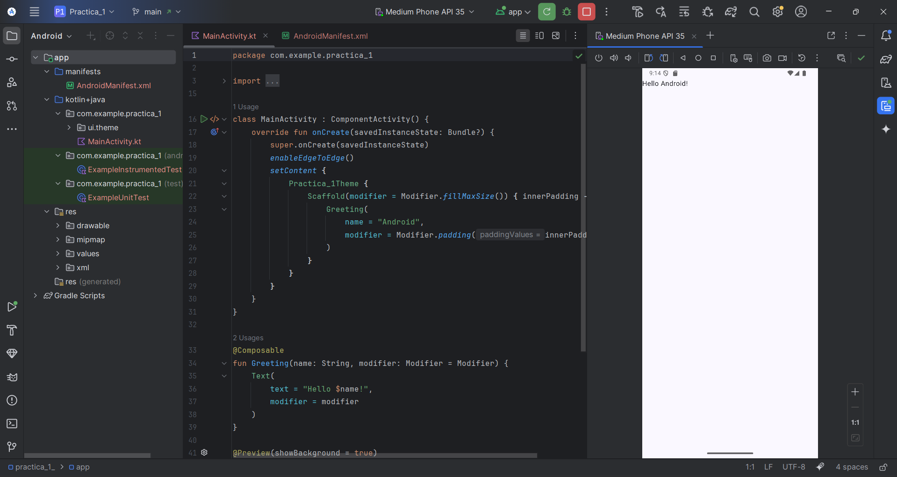

# Práctica 1 - Instalación y Funcionamiento de los Entornos Móviles

## Objetivo
Fortalecer las habilidades de desarrollo móvil a través de la exploración e implementación de entornos de navegación, la gestión de actividades múltiples y la personalización de interfaces de usuario en aplicaciones nativas de Android.

## Ejercicio 1
Se nos solicita instalar y configurar las siguientes herramientas esenciales en nuestro sistema operativo (Windows) para el desarrollo de proyectos de Android:
- Android Studio
- Java Development Kit (JDK)/Amazon Coretto
- Maven
- Git 
- GitHub
- Docker
- Node.js
- Flutter en VS Code

Como evidencia de esta actividad se presenta la captura del IDE (Android Studio) mostrando el emulador con la aplicación default que genera Android Studio de forma predeterminada.

## Ejercicio 2
1. Para esta segunda actividad debemos crear una aplicación Android que demuestre el uso de Activities y Fragments para explicar diferentes elementos de interfaz de usuario como lo son:
- TextFields (EditText)
- Botones (Button, ImageButton)
- Elementos de selección (CheckBox, RadioButton, Switch)
- Listas (RecyclerView, ListView)
- Elementos de información (TextView, ImageView, ProgressBar)
Cada clase de elementos pertenecerá a un Fragment, dichos Fragments estarán dentro de un Activity.
2. Además se incluirá un menú de navegación para navegar entre cada fragment. Cada Fragment será accesible desde un menú principal. 
3. El contenido de cada Fragment será el siguiente:
- 📝 Un título descriptivo del elemento de UI.
- 🎨 Ejemplos visuales del elemento funcionando.
- 💡 Una explicación breve de para qué sirve (máximo 2-3 líneas).
- ⚡ Una demostración interactiva donde el usuario pueda probar el elemento.
4. Se deberá crear una versión de la aplicación en Kotlin (Android Nativo) y otra versión en Dart (Flutter).

## Desafíos y Hallazgos
La creación de los proyectos tuvo sus complicaciones, siendo que:
1. Crear un proyecto en Flutter implica un mejor orden, pero es necesario llevar una mejor gestión de los directorios.
2. Dart necesita menos líneas de código que Kotlin.
3. No se pudo llevar una misma GUI para ambos proyectos, por lo que la versión de Kotlin tiene todos los elementos que solicita la práctica a diferencia de la versión de Dart.
4. Los Activities en Android Nativo necesitan ser declarados en AndroidManifest.xml a comparación de Flutter (Dart), en el que no es necesario.
5. La equivalencia de Activities y Fragments de Kotlin son las Screens y Widgets de Dart.
