# 📱 Práctica 1 - Instalación y Funcionamiento de los Entornos Móviles en Android

## 🎯 Descripción del Proyecto

Esta aplicación Android fue desarrollada como una demostración práctica de los elementos fundamentales de interfaz de usuario nativa, implementando las mismas funcionalidades que la versión Flutter pero usando tecnologías nativas de Android. El proyecto utiliza una arquitectura basada en Activities y Fragments, siguiendo las mejores prácticas de desarrollo Android.

### 🏗️ Arquitectura del Proyecto

- **Arquitectura por Componentes**: Separación clara entre Activities y Fragments especializados
- **Patrón Fragment-Based**: Implementación modular con Fragments reutilizables por pantalla
- **Material Design**: Uso consistente del sistema de diseño de Google para Android
- **Bottom Navigation**: Navegación intuitiva entre secciones principales

### 🎨 Características Principales

- ✅ **5 Fragments Temáticos** organizados por tipo de componente UI
- ✅ **Navegación Bottom Navigation** entre secciones
- ✅ **Interactividad Completa** con feedback visual nativo
- ✅ **Material Design Components** nativos de Android
- ✅ **Gestión de Estado** preservado durante rotaciones
- ✅ **Código Kotlin** moderno y eficiente

## 📋 Funcionalidades por Fragment

### 🔤 1. Campos de Texto (TextFieldsFragment)
**Componentes Android**: `EditText`, `TextInputLayout`

**Componentes implementados:**
- **Campo de Texto Normal**: `EditText` básico con hint
- **Campo de Contraseña**: `TextInputEditText` con toggle de visibilidad
- **Campo Multilínea**: `EditText` configurado para múltiples líneas
- **Campo Numérico**: `EditText` con `inputType="number"`
- **Vista de Resultados**: `TextView` con actualización en tiempo real

**Características técnicas:**
- Uso de `TextWatcher` para actualización en tiempo real
- `TextInputLayout` con Material Design
- Validación de entrada y feedback visual
- Preservación de texto durante rotaciones

### 🔘 2. Botones (ButtonsFragment)
**Componentes Android**: `Button`, `ImageButton`, `FloatingActionButton`

**Componentes implementados:**
- **Botón Material**: `Button` estándar con theming
- **Botón de Color**: `Button` con personalización de colores
- **ImageButton**: Botón circular con icono
- **FloatingActionButton**: FAB de Material Design
- **Contador de Clics**: Seguimiento de interacciones
- **Snackbar**: Notificaciones temporales nativas

**Características técnicas:**
- `OnClickListener` para manejo de eventos
- `SharedPreferences` para persistencia del contador
- Animaciones de Material Design
- Theming dinámico de botones

### ☑️ 3. Elementos de Selección (SelectionElementsFragment)
**Componentes Android**: `CheckBox`, `RadioButton`, `Switch`

**Componentes implementados:**
- **CheckBox**: Configuraciones de conectividad (WiFi, Bluetooth, Datos)
- **RadioGroup**: Selector de tema (Claro, Oscuro, Automático)
- **Switch**: Configuraciones adicionales (Notificaciones, Ubicación)
- **Panel de Resumen**: Vista consolidada de configuración actual

**Características técnicas:**
- `RadioGroup` para selección exclusiva
- `OnCheckedChangeListener` para todos los controles
- Estado persistente de configuraciones
- Actualización dinámica del panel de resumen

### 📋 4. Listas (ListsFragment)
**Componentes Android**: `RecyclerView`, `CardView`

**Componentes implementados:**
- **RecyclerView**: Lista eficiente con adapter personalizado
- **CardView**: Elementos con Material Design y elevación
- **ViewHolder Pattern**: Optimización de rendimiento
- **Click Listeners**: Respuesta táctil con feedback

**Características técnicas:**
- `RecyclerView.Adapter` con `ViewHolder`
- `DiffUtil` para actualizaciones eficientes
- `CardView` con ripple effects
- Layout Manager personalizable

### ℹ️ 5. Elementos de Información (InformationElementsFragment)
**Componentes Android**: `ProgressBar`, `ImageView`, `TextView`

**Componentes implementados:**
- **ProgressBar**: Indicadores circulares y horizontales
- **ImageView**: Carrusel de imágenes con navegación
- **TextView**: Información organizada y estructurada
- **Animaciones**: Progreso animado de 0 a 100%

**Características técnicas:**
- `ProgressBar` con animación personalizada
- `ViewPager2` para carrusel de imágenes
- `Handler` y `Runnable` para animaciones temporales
- `Drawable` vectoriales para iconos

## 🚀 Instrucciones de Ejecución

### 📋 Prerrequisitos

1. **Android Studio** (versión Flamingo o superior)
   - SDK de Android instalado
   - Build Tools actualizados

2. **JDK** (Java 17 o superior)
   ```bash
   java -version
   ```

3. **Emulador o Dispositivo Físico**:
   - AVD configurado con API 24+ (Android 7.0+), o
   - Dispositivo Android con depuración USB habilitada

### ⚙️ Configuración del Entorno

1. **Verificar instalación de Android SDK:**
   - Abrir Android Studio
   - Ir a `Tools > SDK Manager`
   - Verificar que esté instalado Android SDK 24+

2. **Verificar dispositivos disponibles:**
   - `Tools > AVD Manager` para emuladores
   - `adb devices` para dispositivos físicos

### 🛠️ Instalación y Ejecución

#### Opción 1: Ejecutar desde Android Studio

1. **Abrir el proyecto en Android Studio**
2. **Seleccionar dispositivo** en la barra superior
3. **Hacer clic en Run (▶️)** o usar `Shift+F10`
4. **Alternativamente**: `Run > Run 'app'`

#### Opción 2: Compilación por línea de comandos

```bash
# Navegar al directorio del proyecto
cd practica_1_android

# Limpiar proyecto (opcional)
./gradlew clean

# Compilar y ejecutar
./gradlew installDebug
```

#### Opción 3: Instant Run para Desarrollo

- **Durante el desarrollo**, usa Instant Run para aplicar cambios rápidamente:
  - Hacer cambios en el código
  - Presionar `Ctrl+Shift+F10` para Apply Changes
  - O usar los botones de Apply Changes en la toolbar

### 📦 Generación de APK

#### APK de Debug (desarrollo):
```bash
./gradlew assembleDebug
```

#### APK de Release (producción):
```bash
./gradlew assembleRelease
```

#### Bundle para Play Store:
```bash
./gradlew bundleRelease
```

**Ubicación de archivos generados:** `app/build/outputs/apk/`

### 🧪 Testing y Depuración

#### Ejecutar lint y análisis:
```bash
./gradlew lint
```

#### Ejecutar tests unitarios:
```bash
./gradlew test
```

#### Ejecutar tests instrumentales:
```bash
./gradlew connectedAndroidTest
```

#### Debugging con Layout Inspector:
- En Android Studio: `Tools > Layout Inspector`
- Seleccionar proceso de la app para inspeccionar la UI

### 🔧 Solución de Problemas Comunes

1. **Error "No target device found":**
   - Verificar que el emulador esté iniciado
   - Conectar dispositivo físico con depuración USB
   - Verificar con `adb devices`

2. **Error de sincronización de Gradle:**
   ```bash
   ./gradlew clean
   ./gradlew --refresh-dependencies
   ```

3. **Error de JDK incompatible:**
   - Verificar que `JAVA_HOME` apunte a JDK 17+
   - En Android Studio: `File > Project Structure > SDK Location`

4. **Instant Run no funciona:**
   - Limpiar proyecto con `Build > Clean Project`
   - Reconstruir con `Build > Rebuild Project`

### 🎮 Cómo Probar la Aplicación

1. **Pantalla Principal**: Navega entre las 5 secciones usando las tarjetas
2. **Bottom Navigation**: Usa la barra inferior para cambiar entre fragments
3. **Campos de Texto**: Ingresa texto y observa la actualización en tiempo real
4. **Botones**: Prueba todos los botones y observa el contador y Snackbars
5. **Elementos de Selección**: Cambia configuraciones y observa el resumen
6. **Listas**: Toca elementos del RecyclerView para ver interacciones
7. **Información**: Inicia progress bars y navega por las imágenes

## 🏗️ Estructura del Proyecto

```
practica_1_android/
├── app/
│   ├── src/
│   │   └── main/
│   │       ├── kotlin/com/example/tarea_1/
│   │       │   ├── MainActivity.kt                    # Actividad principal con Bottom Navigation
│   │       │   ├── OptionsActivity.kt                # Actividad de menú principal
│   │       │   ├── TextFieldsFragment.kt             # Fragment de campos de texto
│   │       │   ├── ButtonsFragment.kt                # Fragment de botones
│   │       │   ├── SelectionElementsFragment.kt      # Fragment de elementos de selección
│   │       │   ├── ListsFragment.kt                  # Fragment de listas
│   │       │   └── InformationElementsFragment.kt    # Fragment de elementos informativos
│   │       ├── res/
│   │       │   ├── layout/
│   │       │   │   ├── activity_main.xml             # Layout del menú principal
│   │       │   │   ├── menu_principal.xml            # Layout con Bottom Navigation
│   │       │   │   ├── fragment_textfields.xml       # Layout del fragment de texto
│   │       │   │   ├── fragment_buttons.xml          # Layout del fragment de botones
│   │       │   │   ├── fragment_selection.xml        # Layout del fragment de selección
│   │       │   │   ├── fragment_lists.xml            # Layout del fragment de listas
│   │       │   │   ├── fragment_information.xml      # Layout del fragment de información
│   │       │   │   └── item_list.xml                 # Layout de items de RecyclerView
│   │       │   ├── values/
│   │       │   │   ├── strings.xml                   # Textos de la aplicación
│   │       │   │   ├── colors.xml                    # Colores del tema
│   │       │   │   ├── themes.xml                    # Temas de Material Design
│   │       │   │   └── dimens.xml                    # Dimensiones y espaciados
│   │       │   ├── drawable/                         # Recursos gráficos
│   │       │   ├── menu/
│   │       │   │   └── bottom_navigation_menu.xml    # Menú de navegación inferior
│   │       │   └── mipmap/                           # Iconos de la aplicación
│   │       └── AndroidManifest.xml                   # Manifiesto de la aplicación
│   ├── build.gradle.kts                              # Configuración de Gradle del módulo
│   └── proguard-rules.pro                            # Reglas de ProGuard
├── build.gradle.kts                                  # Configuración de Gradle del proyecto
├── settings.gradle.kts                               # Configuración de módulos
├── gradle.properties                                 # Propiedades de Gradle
├── evidencias/                                       # Capturas de pantalla y videos
└── README.md                                         # Este archivo
```

## 🎨 Capturas de Pantalla

<div align="center">

### Pantallas Principales

#### Pantalla de Inicio
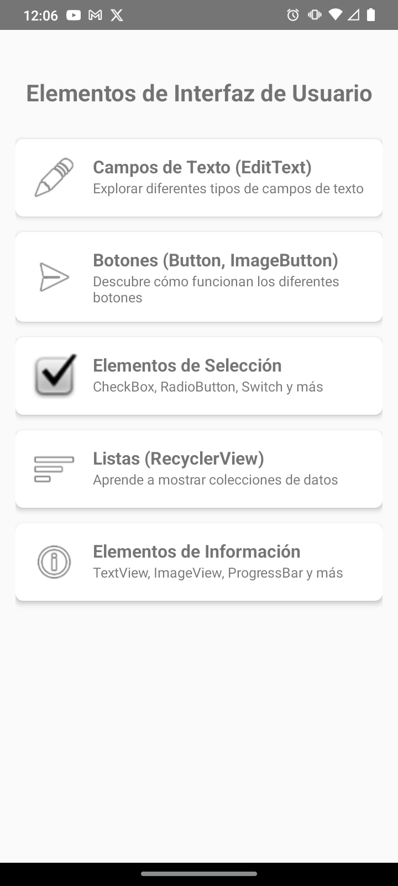

*Pantalla principal con tarjetas de navegación hacia cada sección*

---

#### Campos de texto 
| Fragment de TextFields | Interacción en Vivo |
|:----------------------:|:-------------------:|
| 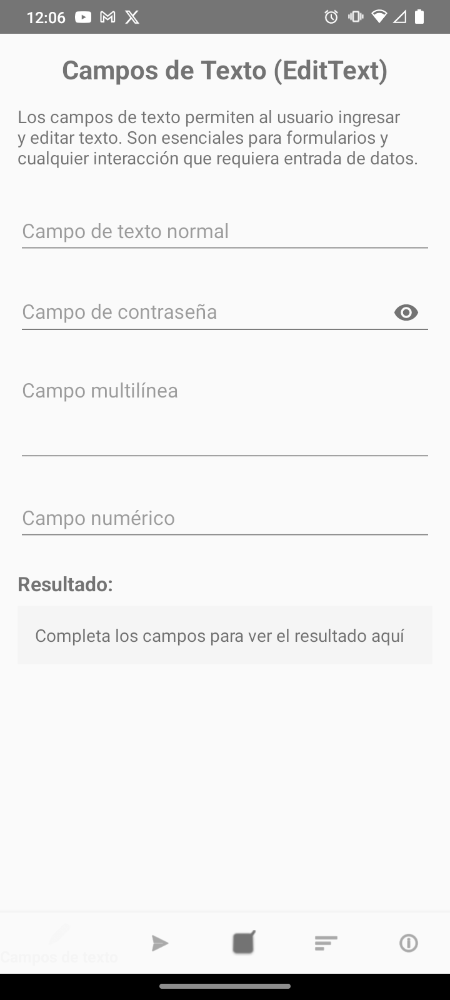 | 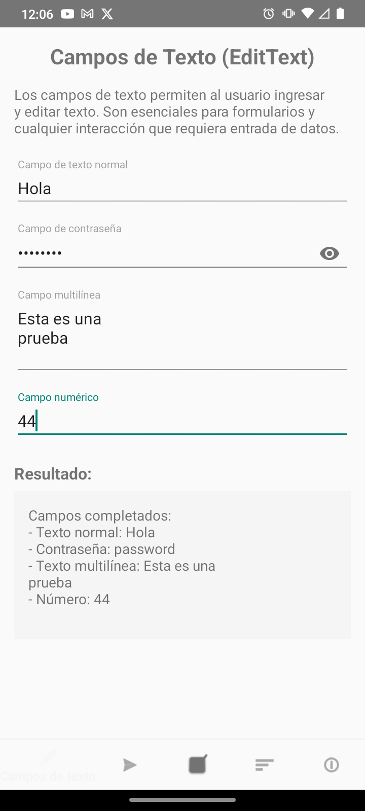 |

*Demostración de diferentes tipos de EditText con validación en tiempo real*

---

#### Demostración de botones
| Fragment de Botones | Contadores Activos |
|:-------------------:|:------------------:|
| 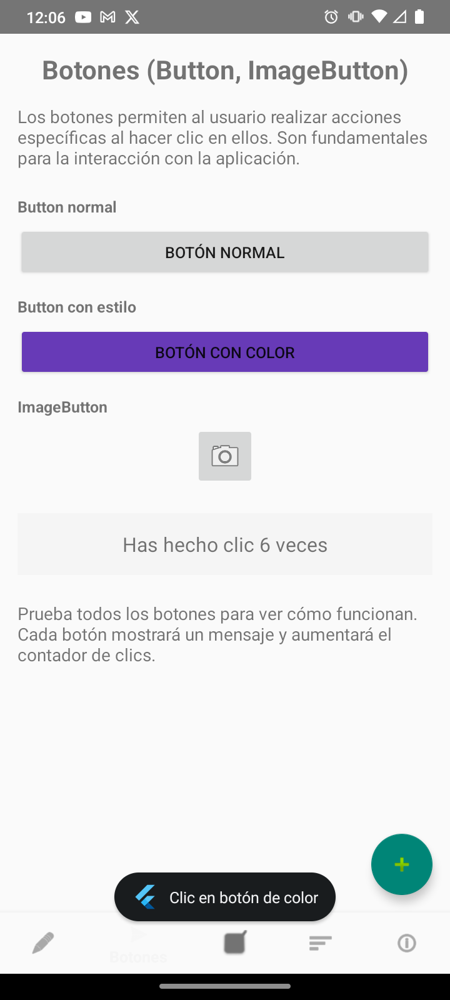 | 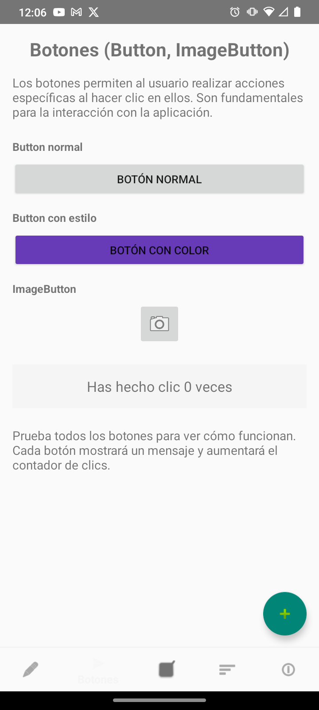 |

*Variedad de botones nativos con contador de interacciones y Snackbar*

---

#### Elementos de selección 
| Configuraciones | Estados Activos |
|:---------------:|:---------------:|
| 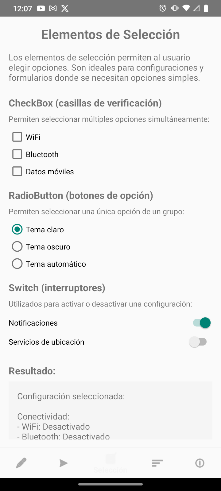 | 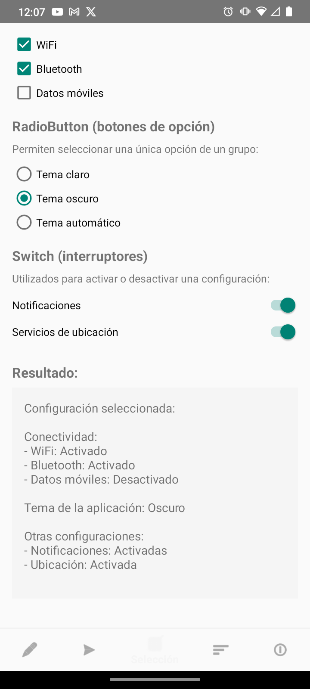 |

*CheckBox, RadioButton y Switch con configuraciones de sistema*

---

#### Lista interactiva 
| RecyclerView Principal | Interacciones |
|:----------------------:|:-------------:|
| 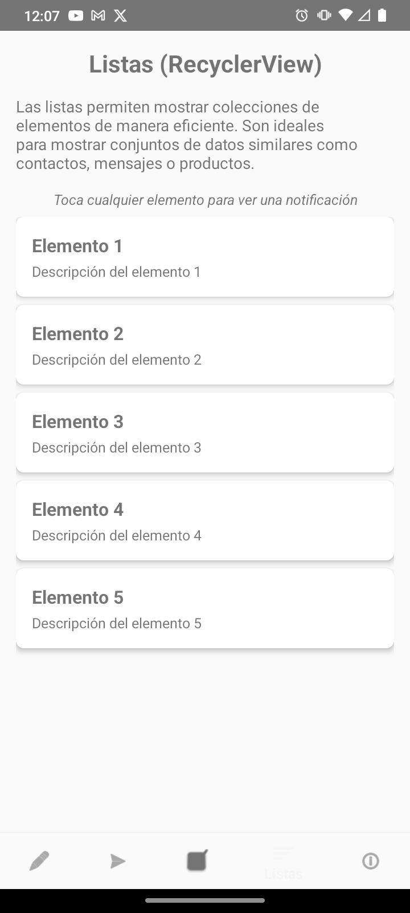 | 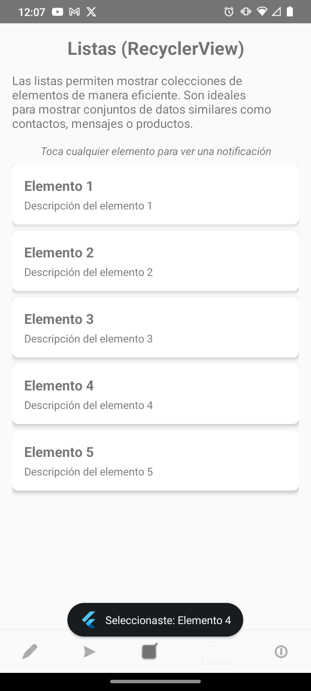 |

*RecyclerView con CardView y elementos interactivos*

---

#### Elementos informativos y progreso
| ProgressBar | Carrusel de Imágenes |
|:-----------:|:--------------------:|
| 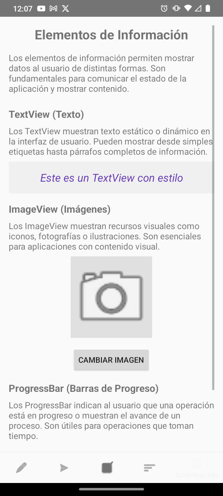 | 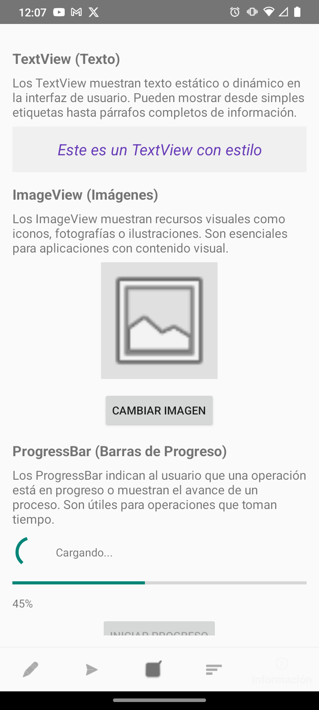 |

*ProgressBar animado, ImageView con ViewPager2 y TextView informativos*

---

</div>

### 🎬 Demostración Completa en Video

<div align="center">
    
    <br>
    <em>Flujo completo de la aplicación Android mostrando todas las funcionalidades nativas</em>
</div>

## 🛠️ Tecnologías Utilizadas

- **Kotlin** - Lenguaje de programación moderno para Android
- **Android SDK** - Kit de desarrollo de Android
- **AndroidX** - Librerías de soporte modernas
- **Material Design Components** - Componentes de UI nativos
- **Fragment Navigation** - Navegación entre componentes
- **RecyclerView** - Listas eficientes y optimizadas
- **ViewBinding** - Binding seguro de vistas
- **ConstraintLayout** - Layout flexible y responsivo