# 📱 Práctica 1 - Instalación y Funcionamiento de los Entornos Móviles en Flutter

## 🎯 Descripción del Proyecto

Esta aplicación Flutter fue desarrollada como una demostración práctica de los elementos fundamentales de interfaz de usuario, mostrando sus equivalencias con los componentes de Android nativo. El proyecto implementa una arquitectura modular con widgets reutilizables, siguiendo las mejores prácticas de desarrollo en Flutter.

### 🏗️ Arquitectura del Proyecto

- **Estructura Modular**: Separación clara entre pantallas y widgets reutilizables
- **Patrón de Diseño**: Implementación de widgets personalizados extraídos de las pantallas
- **Material Design**: Uso consistente del sistema de diseño de Google
- **Responsive Design**: Adaptación automática a diferentes tamaños de pantalla

### 🎨 Características Principales

- ✅ **5 Pantallas Temáticas** organizadas por tipo de componente UI
- ✅ **Widgets Reutilizables** extraídos en módulos independientes
- ✅ **Interactividad Completa** con feedback visual inmediato
- ✅ **Navegación Fluida** entre pantallas
- ✅ **Diseño Responsivo** que funciona en móvil y desktop
- ✅ **Código Limpio** con documentación inline

## 📋 Funcionalidades por Pantalla

### 🔤 1. Campos de Texto (TextFields)
**Equivalente Android**: `EditText`

**Componentes implementados:**
- **Campo de Texto Normal**: Entrada básica de texto plano
- **Campo de Contraseña**: Texto oculto con icono de visibilidad
- **Campo Multilínea**: Soporte para texto de múltiples líneas
- **Campo Numérico**: Teclado numérico y validación automática
- **Vista de Resultados**: Actualización en tiempo real del contenido

**Widgets personalizados utilizados:**
- `CustomFormField` - Campo de formulario configurable
- `FormFieldGroup` - Agrupador de campos relacionados
- `ResultDisplay` - Mostrador de resultados dinámicos

### 🔘 2. Botones (Buttons)
**Equivalente Android**: `Button`, `ImageButton`

**Componentes implementados:**
- **Botón Elevado**: Botón estándar de Material Design
- **Botón de Color**: Botón con personalización de colores
- **Botón de Icono**: Botón circular con icono central
- **Botón Flotante**: FAB (Floating Action Button)
- **Contador de Interacciones**: Seguimiento de clics
- **Notificaciones Temporales**: SnackBar con feedback

**Widgets personalizados utilizados:**
- `CustomButton` - Botón configurable con múltiples tipos
- `CounterDisplay` - Contador visual de interacciones
- `ButtonGroup` - Agrupador de botones relacionados

### ☑️ 3. Elementos de Selección
**Equivalente Android**: `CheckBox`, `RadioButton`, `Switch`

**Componentes implementados:**
- **Configuración de Conectividad**: WiFi, Bluetooth, Datos móviles
- **Selector de Tema**: Claro, Oscuro, Automático
- **Configuraciones Adicionales**: Notificaciones, Ubicación
- **Panel de Resultado**: Resumen de configuración actual

**Widgets personalizados utilizados:**
- `SettingsCheckboxTile` - Checkbox con etiqueta
- `SettingsRadioTile` - RadioButton agrupado
- `SettingsSwitchTile` - Switch con configuración
- `SettingsSection` - Organizador de configuraciones

### 📋 4. Listas (Lists)
**Equivalente Android**: `RecyclerView`, `ListView`

**Componentes implementados:**
- **Lista Eficiente**: Renderizado optimizado con `ListView.builder`
- **Elementos Interactivos**: Respuesta táctil con feedback
- **Diseño Atractivo**: Cards con elevación y sombras
- **Avatares Numerados**: Identificación visual de elementos

**Widgets personalizados utilizados:**
- `CustomListView` - Lista configurable y reutilizable
- `CustomListItem` - Elemento de lista personalizable
- `ListItem` - Modelo de datos para elementos

### ℹ️ 5. Elementos de Información
**Equivalente Android**: `TextView`, `ImageView`, `ProgressBar`

**Componentes implementados:**
- **Indicadores de Progreso**: Circular y lineal con animación
- **Carrusel de Imágenes**: Navegación entre iconos/imágenes
- **Tarjetas Informativas**: Información organizada visualmente
- **Progreso Simulado**: Carga animada de 0 a 100%

**Widgets personalizados utilizados:**
- `ProgressIndicatorWidget` - Indicador de progreso animado
- `ImageCarousel` - Carrusel de iconos navegable
- `InfoListWidget` - Lista de información con iconos

## 🚀 Instrucciones de Ejecución

### 📋 Prerrequisitos

1. **Flutter SDK** (versión 3.0 o superior)
   ```bash
   flutter --version
   ```

2. **Editor de Código** (VS Code recomendado con extensiones):
   - Flutter extension
   - Dart extension

3. **Emulador o Dispositivo Físico**:
   - Android Studio con AVD configurado, o
   - Dispositivo Android con depuración USB habilitada, o
   - Simulador iOS (solo macOS)

### ⚙️ Configuración del Entorno

1. **Verificar instalación de Flutter:**
   ```bash
   flutter doctor
   ```
   > Asegúrate de que no haya errores críticos

2. **Verificar dispositivos disponibles:**
   ```bash
   flutter devices
   ```

### 🛠️ Instalación y Ejecución

#### Opción 1: Ejecutar desde VS Code

1. **Abrir el proyecto en VS Code**
2. **Seleccionar dispositivo** en la barra inferior
3. **Presionar F5** o usar `Run > Start Debugging`
4. **Alternativamente**: `Ctrl+Shift+P` > "Flutter: Run"

#### Opción 2: Hot Reload para Desarrollo

- **Durante el desarrollo**, usa Hot Reload para ver cambios instantáneos:
  - Presiona `r` en la terminal donde corre `flutter run`
  - O usa `Ctrl+S` en VS Code con auto-save

### 📦 Generación de APK

#### APK de Debug (desarrollo):
```bash
flutter build apk --debug
```

#### APK de Release (producción):
```bash
flutter build apk --release
```

#### APKs optimizados por arquitectura:
```bash
flutter build apk --split-per-abi
```

**Ubicación de archivos generados:** `build/app/outputs/flutter-apk/`

### 🧪 Testing y Depuración

#### Ejecutar análisis de código:
```bash
flutter analyze
```

#### Ejecutar tests (si están disponibles):
```bash
flutter test
```

#### Modo de inspección de widgets:
- En modo debug, presiona `w` en la terminal para activar el inspector de widgets

### 🔧 Solución de Problemas Comunes

1. **Error de "No devices found":**
   - Verificar que el emulador esté iniciado
   - Conectar dispositivo físico con depuración USB

2. **Error de dependencias:**
   ```bash
   flutter clean
   flutter pub get
   ```

3. **Error de Gradle (Android):**
   - Verificar que JAVA_HOME apunte a JDK 17 o superior
   - Actualizar Android SDK si es necesario

4. **Hot reload no funciona:**
   - Reiniciar la aplicación con `R` (Hot restart)
   - Verificar que los archivos se estén guardando

### 🎮 Cómo Probar la Aplicación

1. **Pantalla Principal**: Navega entre las 5 secciones usando las tarjetas
2. **Campos de Texto**: Ingresa diferentes tipos de texto y observa la actualización en tiempo real
3. **Botones**: Prueba todos los botones y observa el contador y las notificaciones
4. **Elementos de Selección**: Cambia configuraciones y observa el resumen actualizado
5. **Listas**: Toca elementos de la lista para ver la interacción
6. **Elementos de Información**: Inicia el progreso y navega por las imágenes

## 🏗️ Estructura del Proyecto

```
lib/
├── main.dart                     # Punto de entrada de la aplicación
├── screens/                      # Pantallas principales
│   ├── home_screen.dart         # Pantalla principal con navegación
│   ├── text_fields_screen.dart  # Demostración de campos de texto
│   ├── buttons_screen.dart      # Demostración de botones
│   ├── selection_elements_screen.dart # Elementos de selección
│   ├── lists_screen.dart        # Demostración de listas
│   ├── information_elements_screen.dart # Elementos informativos
│   └── main_activity.dart       # Pantalla alternativa (equivalente Activity)
├── widgets/                      # Widgets reutilizables
│   ├── widgets.dart             # Exportador de widgets
│   ├── navigation_card.dart     # Tarjeta de navegación
│   ├── custom_button.dart       # Botón personalizable
│   ├── form_field_widget.dart   # Campos de formulario
│   ├── settings_widgets.dart    # Elementos de configuración
│   ├── custom_list_widget.dart  # Lista personalizada
│   ├── progress_indicator_widget.dart # Indicador de progreso
│   ├── image_carousel.dart      # Carrusel de imágenes
│   ├── info_list_widget.dart    # Lista informativa
│   ├── result_display.dart      # Mostrador de resultados
│   └── README.md               # Documentación de widgets
```

## 🎨 Capturas de Pantalla

### Pantallas Principales:
- Pantalla de inicio con navegación
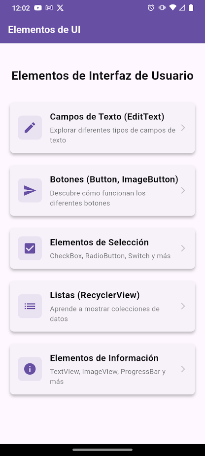

- Campos de texto 
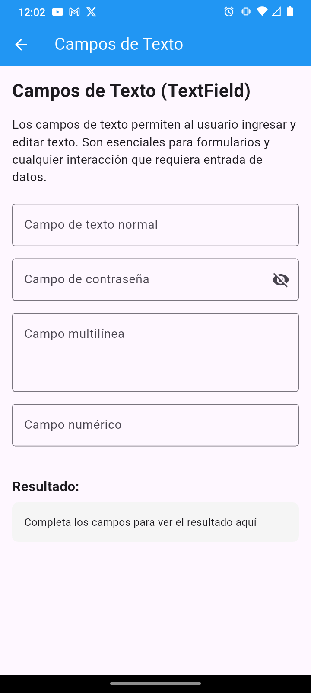
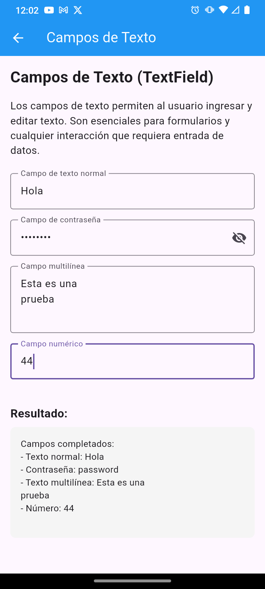

- Demostración de botones
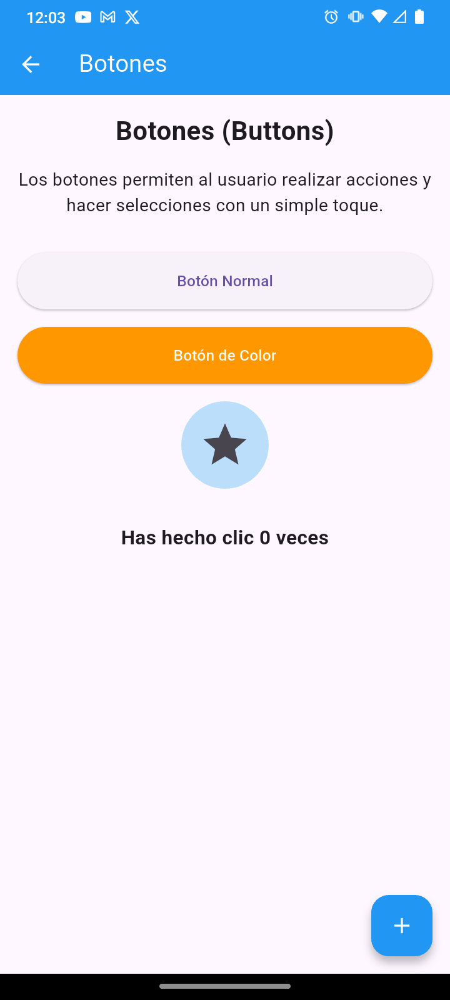
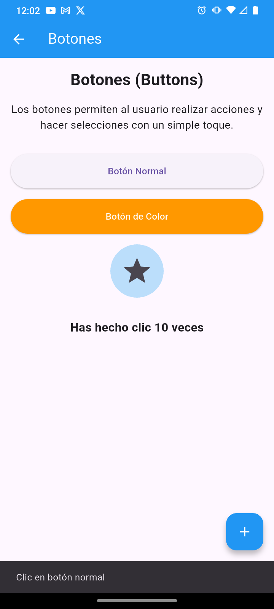

- Elementos de selección 
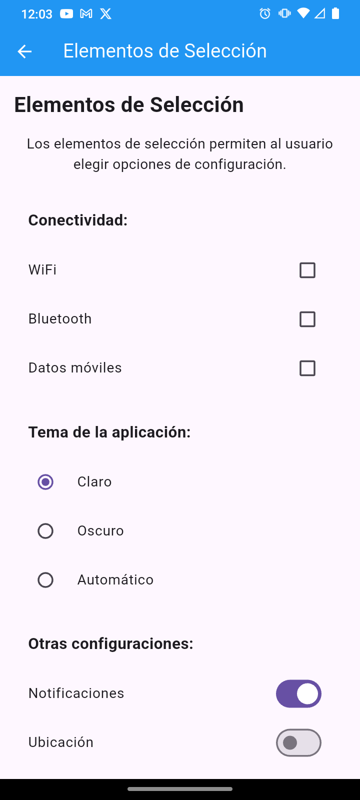
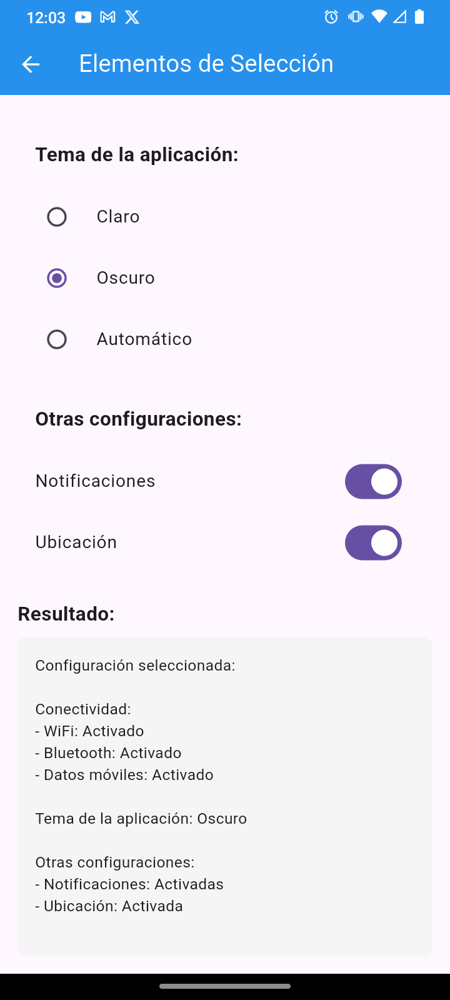

- Lista interactiva 
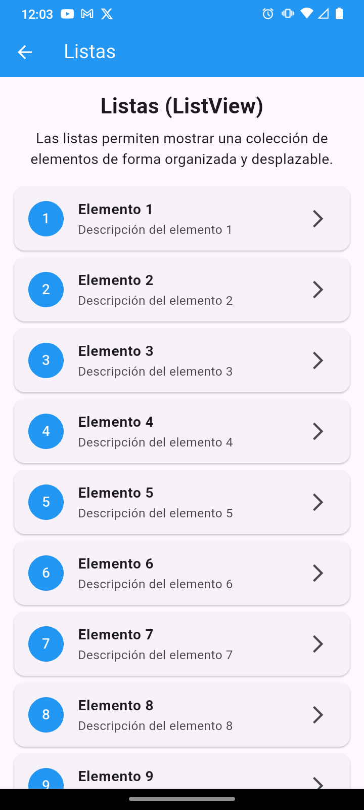
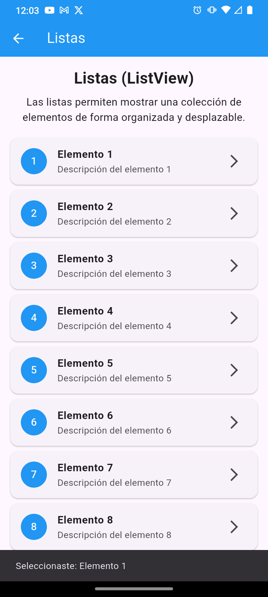

- Elementos informativos y progreso
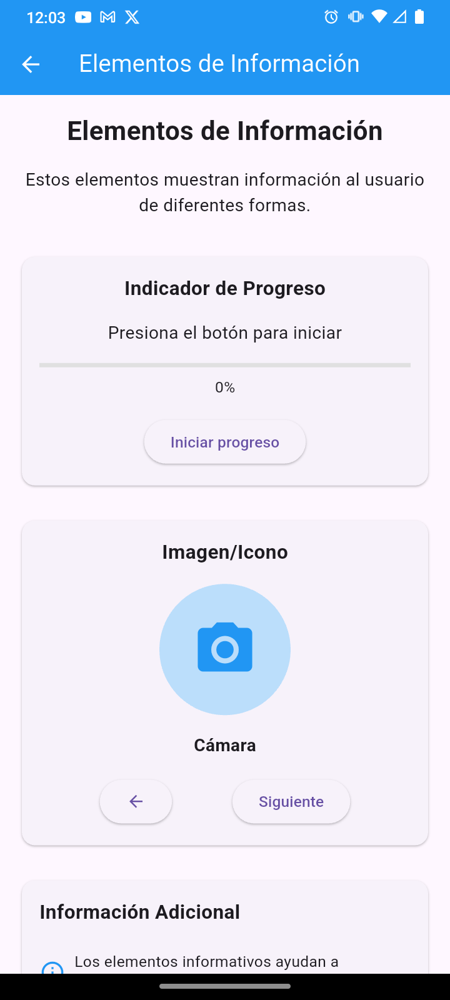
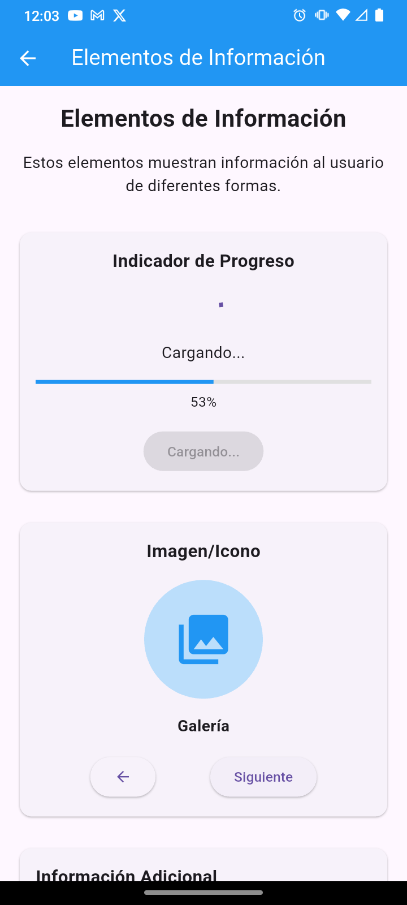
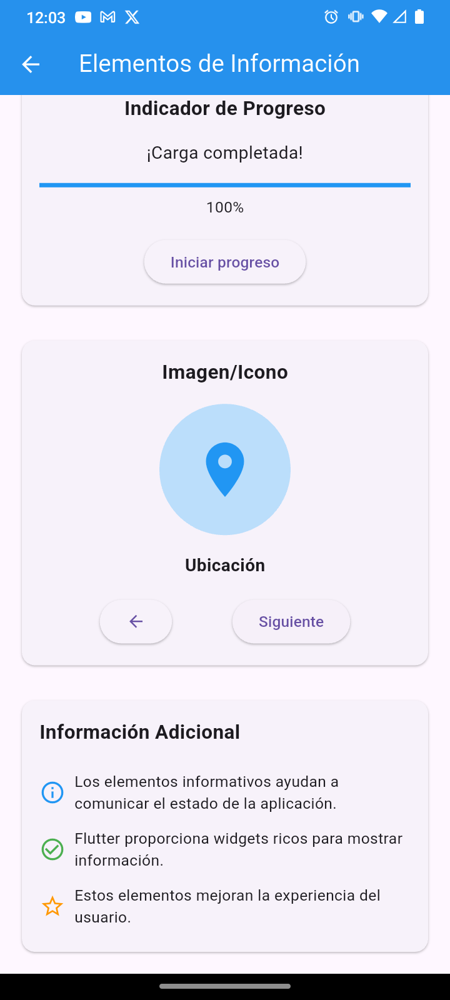

### Vídeo de demostración


<div align="center">
    <video width="300" controls>
        <source src="evidencias/video_evidencia.mp4" type="video/mp4">
    </video>
</div>


## 🛠️ Tecnologías Utilizadas

- **Flutter** 3.x - Framework de desarrollo multiplataforma
- **Dart** - Lenguaje de programación
- **Material Design 3** - Sistema de diseño visual
- **VS Code** - Editor de desarrollo recomendado
