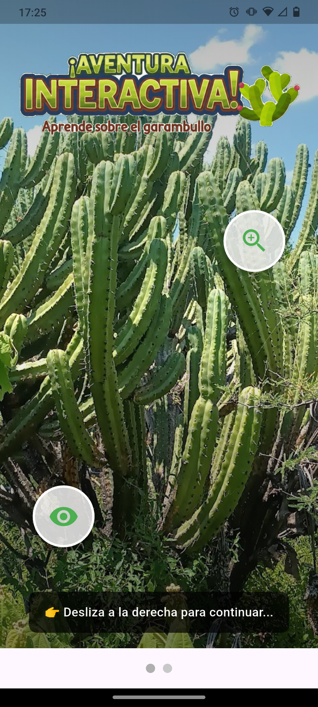
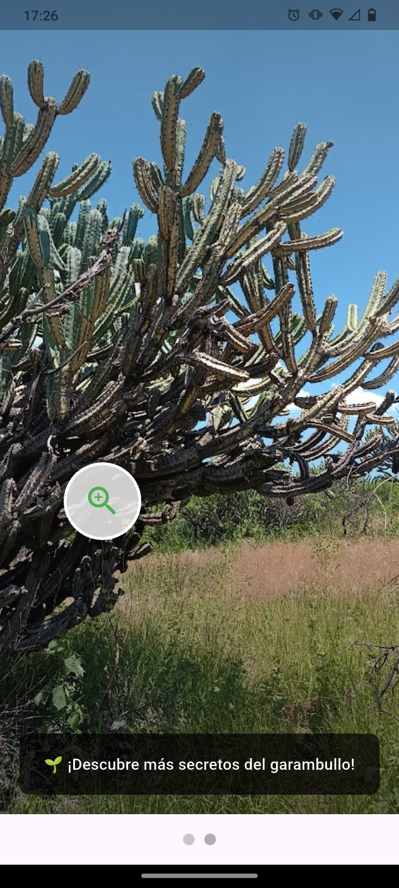
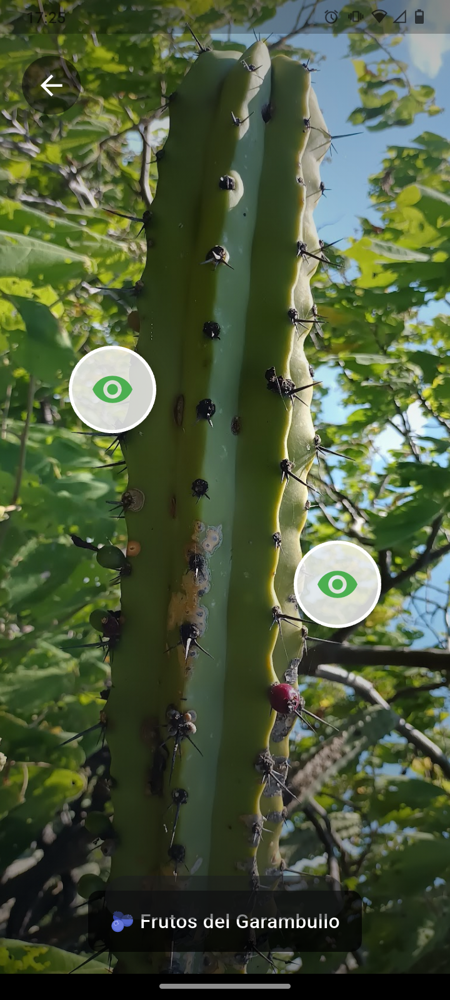
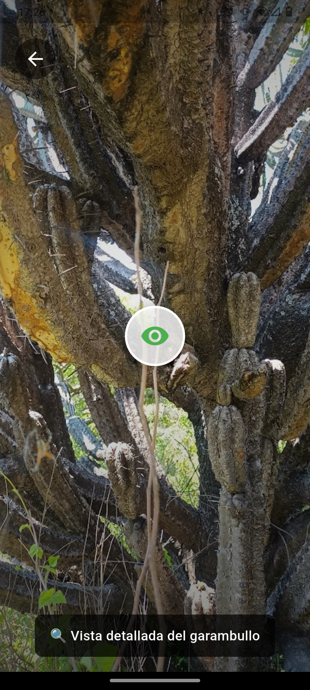
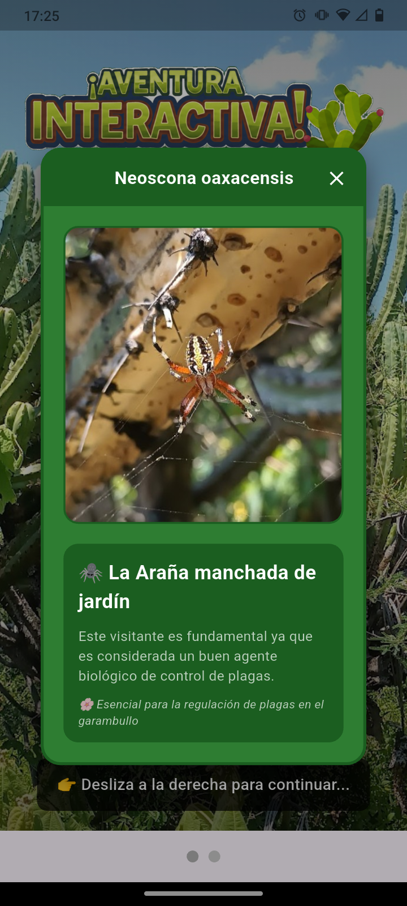
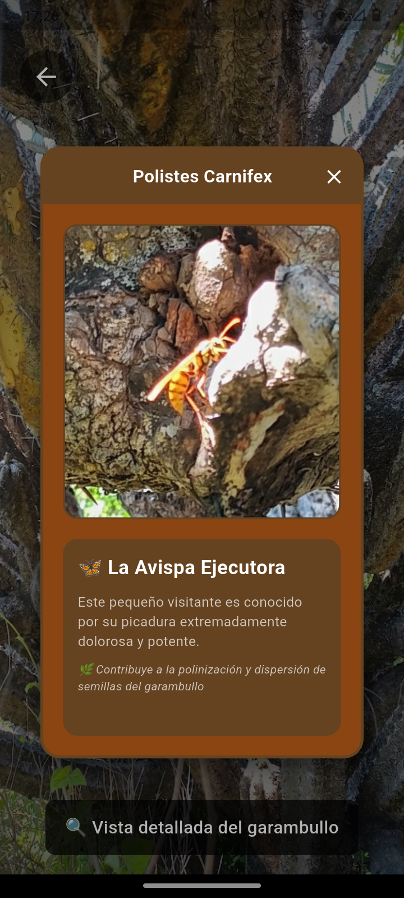
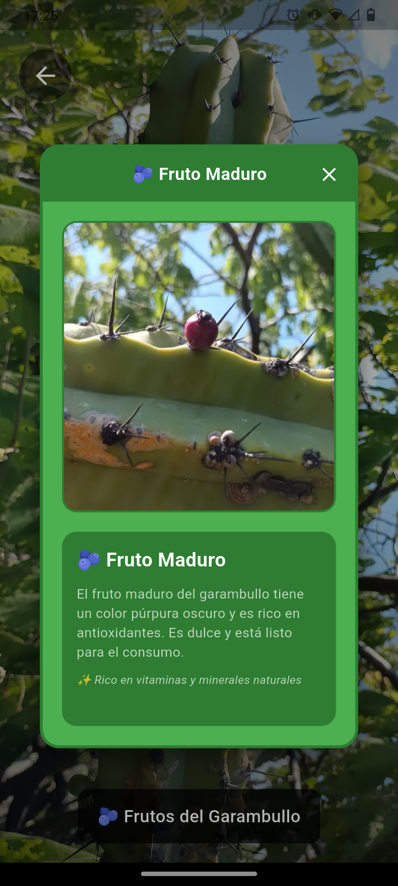
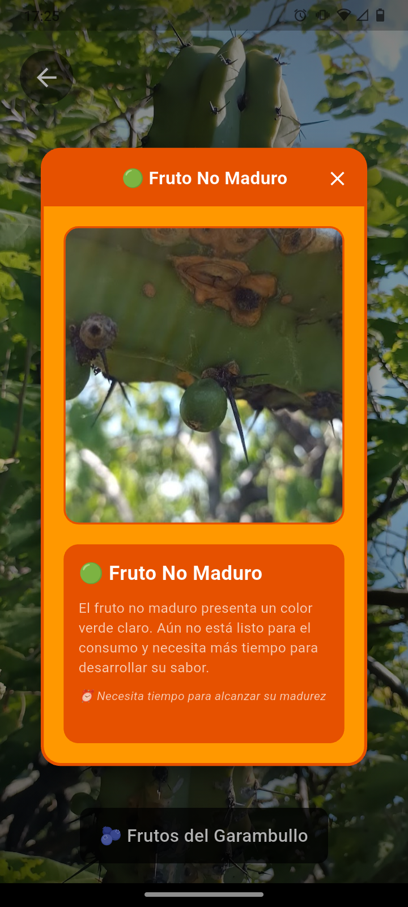

# Tarea 2 - Diseño de una Aventura Interactiva

## Objetivo
Desarrollar una aplicación Android que demuestre una navegación de usuario inmersiva y temática, y que integre elementos de interfaz creativos.

## Descripción del Proyecto
**"Aventura Interactiva del garambullo"** es una aplicación Flutter que presenta una experiencia educativa sobre el garambullo (cactácea nativa mexicana) a través de múltiples pantallas navegables con elementos interactivos y transiciones suaves.

### Características Principales
- 🌱 **Pantalla principal**: Bienvenida con imagen personalizada
- 🔄 **Navegación por gestos**: Deslizamiento horizontal entre pantallas
- 🎯 **Elementos interactivos**: Círculos táctiles para navegación avanzada
- 📱 **Indicadores de página**: Animación SlideEffect para mejor UX
- 🖼️ **Diseño inmersivo**: Imágenes de fondo con overlays graduales
- 🏗️ **Arquitectura modular**: Widgets separados y reutilizables

## Decisiones de Diseño y Mecanismos de Transición

### 🎨 Decisiones de Diseño

#### **1. Arquitectura Modular**
- **Separación de responsabilidades**: Cada pantalla es un widget independiente
- **Widgets reutilizables**: `PageIndicatorWidget` e `InteractiveCircleWidget`
- **Mantenibilidad**: Código organizado en carpetas `screens/` y `widgets/`

#### **2. Diseño Visual Inmersivo**
- **Imágenes de fondo completo**: `BoxFit.cover` para pantalla completa
- **Overlays graduales**: `LinearGradient` para mejor legibilidad del texto
- **Tipografía contrastante**: Texto blanco con sombras negras
- **SafeArea**: Respeta las áreas seguras del dispositivo

#### **3. Experiencia de Usuario (UX)**
- **Navegación intuitiva**: Gestos de deslizamiento horizontal
- **Feedback visual**: Indicadores de página con animación
- **Elementos interactivos claros**: Círculos con iconos y sombras
- **Instrucciones contextuales**: Mensajes que guían al usuario

### 🔄 Mecanismos de Transición

#### **1. PageView para Navegación Principal**
```dart
PageView(
  controller: _pageController,
  children: _screens,
)
```
- **Transición**: Deslizamiento suave entre pantallas principales
- **Control**: `PageController` para gestión programática
- **Responsivo**: Adaptable a diferentes tamaños de pantalla

#### **2. SlideEffect en Indicadores**
```dart
SlideEffect(
  dotHeight: 12,
  dotWidth: 12,
  type: SlideType.normal,
)
```
- **Animación**: Indicador deslizante entre puntos de página
- **Librería**: `smooth_page_indicator` para animaciones profesionales
- **Personalización**: Colores y tamaños configurables

#### **3. Navigator.push para Navegación Avanzada**
```dart
Navigator.push(
  context,
  MaterialPageRoute(builder: (context) => SubAlterScreen()),
)
```
- **Transición**: Animación estándar de material design
- **Stack**: Mantiene historial de navegación
- **Retorno**: Botón back automático en nueva pantalla

## 🎨 Capturas de Pantalla

<div align="center">

### Nivel 1
| Pantalla principal | Pantalla secundaria |
|:----------------------:|:-------------------:|
|  |  |

---

### Nivel 2
| Frutos del garambullo | Base del garambullo |
|:----------------------:|:-------------------:|
|  |  |

--- 

### Nivel 3
| Neoscona oaxacensis | Polistes carnifex | Fruto maduro | Fruto sin madurar | 
|:----------------------:|:-------------------:|:-------------------:|:-------------------:|
|  |  |  |  |

---

</div>

## 🎬 Demostración en Video

<div align="center">
    
    <br>
    <em>Flujo completo de la aplicación mostrando su comportamiento</em>
</div>

## Retos y Soluciones

### 🚧 Reto 1: Gestión de Assets e Imágenes
**Problema**: Las imágenes inicialmente estaban en una carpeta externa al proyecto Flutter.
**Solución**: 
- Creamos la estructura `assets/images/` dentro del proyecto
- Copiamos todas las imágenes al directorio correcto
- Configuramos `pubspec.yaml` para incluir los assets
- Utilizamos rutas relativas en `AssetImage()`

### 🚧 Reto 2: Fondo Transparente en Indicadores
**Problema**: El contenedor de los indicadores de página mostraba fondo blanco por defecto.
**Solución**:
- Aplicamos `color: Colors.transparent` explícitamente
- Creamos widget separado para mejor control del styling
- Implementamos `smooth_page_indicator` para efectos profesionales

### 🚧 Reto 3: Posicionamiento Preciso de Elementos Interactivos
**Problema**: Necesitábamos posicionar círculos interactivos en coordenadas específicas.
**Solución**:
- Implementamos `Positioned` widget con coordenadas exactas
- Creamos `InteractiveCircleWidget` con parámetros de posición
- Utilizamos `MediaQuery` para cálculos responsive
- Añadimos `Stack` layout para superposición de elementos

### 🚧 Reto 4: Navegación Híbrida (Gestos + Toque)
**Problema**: Combinar navegación por deslizamiento con navegación por toque.
**Solución**:
- `PageView` para navegación principal horizontal
- `Navigator.push` para navegación vertical/profunda
- Mantenimiento de contexto y estado entre pantallas
- Botones de retorno consistentes

### 🚧 Reto 5: Arquitectura Modular y Mantenible
**Problema**: Código inicialmente centralizado en `main.dart` dificultaba el mantenimiento.
**Solución**:
- Refactorización a arquitectura por capas (`screens/`, `widgets/`)
- Separación de responsabilidades por funcionalidad
- Widgets reutilizables y configurables
- Imports organizados y documentación clara

## Estructura del Proyecto

```
lib/
├── main.dart                     # Aplicación principal y navegación PageView
├── screens/
│   ├── MainScreen.dart          # Pantalla inicial con imagen de bienvenida
│   ├── AlterScreen.dart         # Segunda pantalla con círculo interactivo
│   └── SubAlterScreen.dart      # Pantalla de detalle con zoom
└── widgets/
    ├── PageIndicatorWidget.dart      # Indicador de páginas con SlideEffect
    └── InteractiveCircleWidget.dart  # Círculo interactivo posicionable

assets/images/
├── bienvenida.png               # Imagen de título principal
├── planta_base_1.jpg           # Fondo de pantalla principal
├── planta_base_2.jpg           # Fondo de segunda pantalla
└── base_2_zoom.jpg             # Imagen de detalle con zoom
```

## Instrucciones de Instalación y Ejecución

### Prerrequisitos
- Flutter SDK (versión 3.9.0 o superior)
- Dart SDK
- Android Studio / VS Code
- Emulador Android o dispositivo físico
- Git